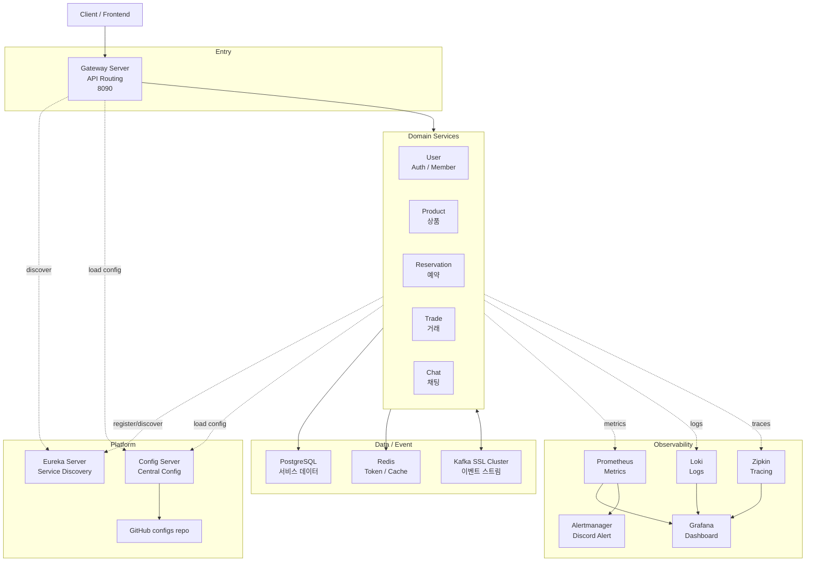
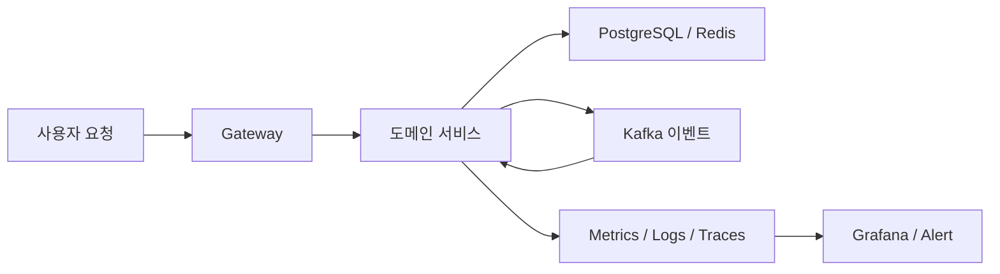
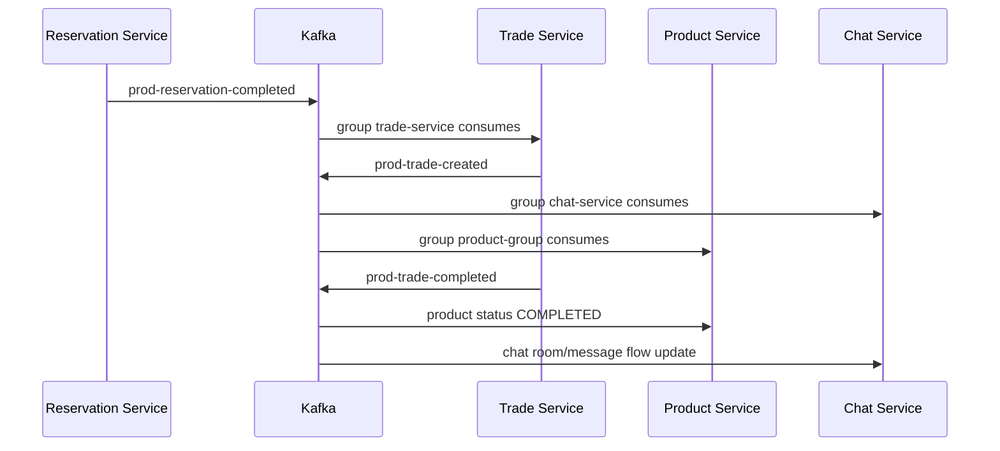

# 8949 (팔구사구)

## 프로젝트 소개

* 중고거래와 타임딜을 결합한 비동기 이벤트 기반 P2P 거래 플랫폼

## 팀 구성 및 담당 작업

| 이름 | 담당 작업 |
| :--- | :--- |
| 김도현 | • 채팅 서비스 구현 및 배포 • 파일 서비스 구현 |
| 김민성 | • 인증/인가 서비스 구현 • 예약 서비스 구현 및 배포 • 인프라 구축(Eureka Server) |
| 김준언 | • 거래 서비스 구현 및 배포 • 인프라 구축(Config Server) |
| 여정진 | • Common 모듈 개발 • 상품 서비스 구현 및 배포 • 인프라 구축(모니터링, 공용 DB) |
| 이현빈 | • 회원/인증 서비스 구현 및 배포 • 인프라 구축(게이트웨이, Kafka) |

## 기술 스택 및 채택 이유

### 💻 Backend & Database

| 기술 스택 | 채택 이유 |
| :--- | :--- |
| **Spring Boot 3.5.x** | MSA 기반의 유연한 서비스 확장을 지원하고, REST API·비즈니스 로직 및 데이터 처리의 간편한 구현을 통해 기능을 생산성 있게 개발하기 위함 |
| **Eureka** | 분산 환경에서 마이크로 서비스 간 동적 위치 조회 및 통신을 유연하게 가능하게 하기 위함 |
| **Spring Data JPA** | 반복적인 CRUD를 줄이고 객체 지향적 데이터 접근과 트랜잭션 관리를 용이하게 하기 위함 |
| **QueryDSL** | 컴파일 시점의 타입 안정성을 확보하고, 복잡한 동적 쿼리 및 데이터 조회 로직을 안정적으로 구현하기 위함 |
| **Spring Security** | 서블릿 필터 기반의 커스터마이징 가능한 보안 체계를 제공하여 유연한 인증/인가를 적용하기 위함 |
| **JWT** | 상태를 저장하지 않는(Stateless) 분산 환경에서 안전하고 컴팩트한 JSON 객체 형태로 인증 정보를 전송하기 위한 웹 표준 |
| **WebSocket** | 채팅 서비스 등에서 클라이언트와 서버가 HTTP 오버헤드 없이 실시간 데이터 전송이 가능하도록 지원하기 위함 |
| **Apache Kafka** | 안정적인 메시지 큐를 제공하고, 서비스 간 비동기 이벤트 기반 통신을 구현하여 도메인 간의 결합도를 최소화하기 위함 |
| **PostgreSQL** | 엄격한 ACID 트랜잭션 일관성을 확보하고, 대규모 서비스 데이터를 안정적으로 관리하기 위함 |
| **Redis** | 빠른 인메모리 데이터 접근이 가능하여, 토큰 관리 및 빈번한 조회 요청에 대한 성능 향상을 도모하기 위함 |

### 🚀 Infra & CI/CD

| 기술 스택 | 채택 이유 |
| :--- | :--- |
| **Docker** | 서비스 구동 환경의 일관성을 확보하고, 컨테이너 기반의 배포 프로세스를 표준화하기 위함 |
| **Google Cloud Platform (GCP)** | 안정적인 클라우드 인프라 위에서 서비스를 유연하게 배포하고 확장하기 위함 |
| **Google Artifact Registry** | 빌드된 컨테이너 이미지를 한곳에서 안전하게 저장, 관리, 배포할 수 있는 중앙 저장소로 활용하기 위함 |
| **GitHub Actions** | CI/CD 파이프라인 자동화를 통해 테스트, 빌드, 배포 과정을 안정적이고 효율적으로 관리하기 위함 |

### 📊 Monitoring & Test

| 기술 스택 | 채택 이유 |
| :--- | :--- |
| **Prometheus** | 시계열 데이터 기반으로 시스템 메트릭을 수집하여 다중 마이크로서비스의 성능 모니터링을 최적화하기 위함 |
| **Loki** | 중앙 집중식 로그 수집을 활용하여 분산된 서비스별 로그 탐색 및 장애 분석 효율성을 향상하기 위함 |
| **Grafana** | 수집된 모니터링 메트릭 및 로그 정보를 시각화하고 대시보드를 제공하여 시스템 상태를 직관적으로 확인하기 위함 |
| **Zipkin** | 서비스 간의 요청 이동 경로와 응답 시간을 시각적으로 추적하여 시스템의 병목 구간과 에러 발생 지점을 한눈에 파악하기 위함 |
| **Postman / Apidog** | GUI 환경에서 HTTP 요청을 손쉽게 생성하여 서버로 전송하고, 반환되는 응답 데이터를 실시간으로 검증하기 위함 |
| **k6** | 스크립트 기반의 오픈소스 부하 테스트를 통해 분산 시스템의 확장성과 안정성을 사전에 검증하기 위함 |

### 🤝 Collaboration & Documentation

| 기술 스택 | 채택 이유 |
| :--- | :--- |
| **ERD Cloud** | 데이터베이스의 테이블 구조와 도메인 간의 관계를 시각적으로 설계하고 팀원들과 실시간으로 공유하기 위함 |
| **draw.io** | 구조적인 아키텍처 다이어그램 및 시각화 자료를 투명하게 작성하기 위함 |
| **GitHub** | 소스코드의 중앙 저장소 역할을 수행하며, Pull Request(PR)와 코드 리뷰를 통해 안정적인 협업 프로세스를 관리하기 위함 |
| **Notion** | 요구사항 정의서, 회의록 작성 등 팀원 간의 원활한 소통과 효율적인 지식 공유를 위한 통합 문서 공간으로 활용 |
| **Discord** | 팀 내의 밀접한 정보 공유와 빠른 커뮤니케이션을 실시간으로 지원하기 위한 채널 |

## ERD

## 시스템 구성 및 아키텍처

프로젝트는 Spring Cloud 기반 MSA 구조로 구성되어 있습니다. 서비스 디스커버리는 Eureka, 중앙 설정은 Config Server와 configs 저장소, 외부 진입점은 Gateway Server가 담당합니다. 도메인 서비스는 User, Product, Reservation, Trade, Chat으로 분리되어 있으며, 서비스 간 상태 전이는 Kafka 이벤트와 Outbox 패턴을 중심으로 연결됩니다.

---

### 인프라 설계도

### 흐름 요약

1. 사용자는 Gateway로만 진입하고, Gateway가 Eureka에서 서비스를 찾아 라우팅합니다.
2. 도메인 서비스는 Config Server에서 설정을 받고, DB/Redis에 상태를 저장하며 Kafka로 서비스 간 이벤트를 전달합니다.
3. 운영 관측은 Prometheus, Loki, Zipkin이 수집하고 Grafana와 Alertmanager에서 확인합니다.

---

### 주요 런타임 컴포넌트

| **영역** | **구성** |
| --- | --- |
| Service discovery | Eureka Server, Eureka Client |
| Central config | Config Server + GitHub configs repo |
| API routing | Gateway Server route predicates |
| DB/cache | PostgreSQL 17, Redis 7 |
| Event broker | Kafka SSL cluster |
| Observability | Prometheus, Grafana, Loki, Promtail, Alertmanager, Zipkin  |

---

## API 라우팅

| **Gateway path** | **Target service** |
| --- | --- |
| /api/v1/auth/** | user-service |
| /api/v1/users/** | user-service |
| /api/v1/products/** | product-service |
| /api/v1/trades/** | trade-service |
| /api/v1/reservations/** | reservation-service |
| /api/v1/chat/** | chat-service |

---

## 이벤트 흐름

### 시퀀스 다이어그램

### 이벤트 흐름도

---

### **Kafka Topic / Consumer Group**

| **Topic** | **Producer / Source** | **Consumer group** |
| --- | --- | --- |
| `prod-reservation-completed` | reservation-service | trade-service, product-group |
| `prod-reservation-cancelled` | reservation-service | product-group |
| `prod-reservation-tradefail` | reservation-service | product-group |
| `prod-reservation-buyercancelled` | reservation-service | product-service |
| `prod-product-created` | product-service | reservation-service |
| `prod-product-failed`   (`prod-reservation-failed`) | reservation-service | product-service |
| `prod-trade-created` | trade-service | chat-service |
| `prod-trade-completed` | trade-service | product-group, chat-service |
| `prod-trade-cancelled` | trade-service | chat-service |
| `prod-chat-room-created` | chat-service | trade-service |
| `prod-chat-message-sent` | chat-service | - |
